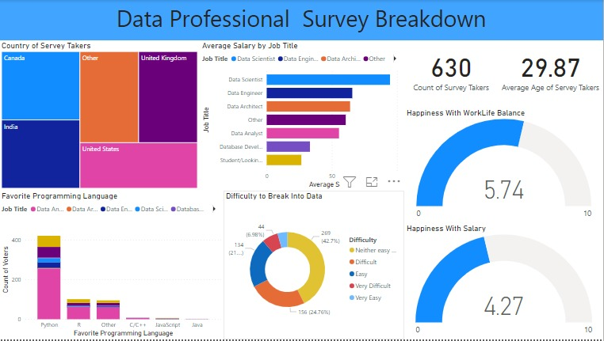

# Data Professional Survey Breakdown

Welcome to the Data Professional Survey Breakdown project! This project aims to analyze data from the "Data Professional  Survey Breakdown.xlsx" file and visualize it using the Power BI project "Projet Power BI.pbix." The dashboard includes various insights on survey takers in the data.

## Dashboard Insights

### 1. Country of Survey Takers
- View the distribution of survey takers by country.

### 2. Average Salary by Job Title
- Visualize the average salary based on job titles.

### 3. Favorite Programming Languages
- Discover the preferred programming languages among survey participants.

### 4. Difficulty in Breaking into Data
- Understand the challenges survey takers face when breaking into the data industry.

### 5. Happiness with Salary
- Explore the correlation between salary and happiness among survey respondents.

### 6. Happiness with Work-Life Balance
- Analyze how work-life balance affects overall happiness.

### 7. Count of Survey Takers
- Find out how many participants took the survey.

### 8. Average Age of Survey Takers
- Determine the average age of survey participants.

## Getting Started

To get started with this project, follow these steps:

1. Clone the repository to your local machine:

   ```bash
   git clone https://github.com/yourusername/Data-Professional-Survey-Breakdown.git
   
   1. Open the Power BI project "projet.pbix" using Power BI Desktop.

   2. Connect the Power BI project to the "Data Professional  Survey Breakdown.xlsx" data source.

   3. Customize the visuals and reports in Power BI as needed.

   4. Save and publish the updated Power BI report to your desired platform.

## Contributing
We welcome contributions to this project! 

If you have any suggestions, bug reports, or want to add new features, please open an issue or create a pull request.
   
